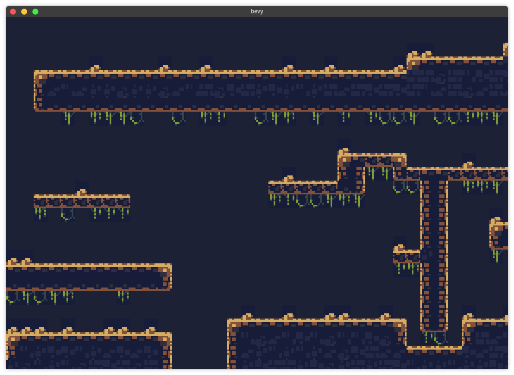

# Bevy LDtk

[](https://crates.io/crates/bevy_ldtk)
[](https://docs.rs/bevy_ldtk)
[](https://github.com/katharostech/katharos-license)

A [Bevy] plugin for loading [LDtk] 2D tile maps.

[ldtk]: https://github.com/deepnight/ldtk
[bevy]: https://bevyengine.org



_( Screenshot assets from the **CanariPack 8BIT TopDown** art pack by **Johan Vinet** )_

## Usage

```rust
use bevy::prelude::*;
use bevy_ldtk::*;

fn main() {
    App::build()
        .add_plugins(DefaultPlugins)
        .add_plugin(LdtkPlugin)
        .add_startup_system(setup.system())
        .run();
}

fn setup(commands: &mut Commands, asset_server: Res<AssetServer>) {
    commands
        // Spawn a camera
        .spawn(Camera2dBundle::default())
        // Spawn a map bundle
        .spawn(LdtkMapBundle {
            // Specify the path to the map asset to load
            map: asset_server.load("map1.ldtk"),
            config: LdtkMapConfig {
                // Automatically set the clear color to the LDtk background color
                set_clear_color: true,
                // You can specify a scale or leave it set to 1 for 1 to 1 pixel size
                scale: 3.0,
                // Set which level to load out of the map or leave it to 0 for the default level
                level: 0,
            },
            ..Default::default()
        });
}
```

### Layers

Each layer in the loaded level is laid out in a quad one unit further away from the camera than the one before. This should allow you to put your character, etc. in the space between the layers to have some layers show in front of the character and the others show behind.

### Running the Example

```bash
cargo run --example display_map
```

You can also copy your own LDtk maps into the assets folder and then run them by specifying the map file name and the level. For instance, this will load the second level from `map2.ldtk`:

```bash
cargo run --example display_map -- map2.ldtk 1
```

### Bevy Versions

| Bevy Version | Plugin Version                                 |
| ------------ | ---------------------------------------------- |
| 0.4          | 0.1, 0.2                                       |
| master       | with the `bevy-unstable` feature ( see below ) |

#### Using Bevy From Master

You can use this crate with Bevy master by adding a patch to your `Cargo.toml` and by adding the `bevy-unstable` feature to this crate:

```toml
[dependencies]
bevy_ldtk = { version = "0.2", features = ["bevy-unstable"] }

[patch.crates-io]
bevy = { git = "https://github.com/bevyengine/bevy.git" }
```

Note that as Bevy master may or may not introduce breaking API changes, this crate may or may not compile when using the `bevy-unstable` feature.

## Features

- An efficient renderer that only uses 4 vertices per map layer and lays out tiles on the GPU
- Supports hot reload through the Bevy asset server integration
- Heavily commented code to help others who want to see how to make their own tilemap renderers.

## Caveats

This plugin is in relatively early stages of development, and while it can load many basic maps, there are some caveats:

- Many features are not supported yet:
  - multiple overlapping autotile tiles
  - tilemaps with spacing in them
  - levels in separate files
- Occasionally some slight rendering artifacts between tiles. Not sure what causes those yet.

If you run into anything that isn't supported that you want to use in your game open an issue or PR to help prioritize what gets implemented.

## License

Bevy LDtk is licensed under the [Katharos License][k_license] which places certain restrictions on what you are allowed to use it for. Please read and understand the terms before using Bevy LDtk for your project.

[k_license]: https://github.com/katharostech/katharos-licens
